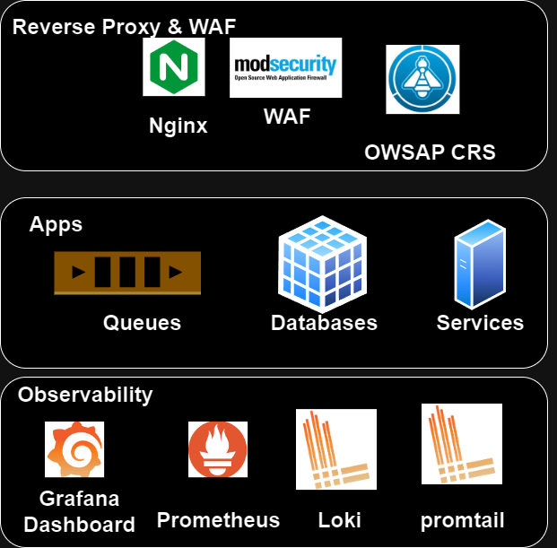

# SecOpsDeploy
The following solution utlize opensource projects such as nginx, mod security, Grafana Prometheus to apply resilient security to deployed web apps. 

## Architecture



## Reverse proxy & Mod Security layer 
- Nginx : Nginx as a reverse proxy and load balancer
- Mod Security: Mod Security as a WAF
- Mod Security Rules: OWASP Core Rule Set (CRS) v3.3.0

The purpose of this layer is to protect the web application from attacks such as SQL injection, XSS, etc.

## Apps layer
- Apps: Your web applications 
- Databases: Your databases
- Queues: protecting your queues managment ui

The purpose of this layer is to protect the web application from attacks such as SQL injection, XSS, etc.

## Observability layer
- Prometheus: Prometheus as a time series database
- Loki: Loki as a log aggregator
- Grafana: Grafana as a visualization tool
- Alert Manager: Alert Manager as an alerting tool
- Node Exporter: Node Exporter as a host metrics collector
- Promtail : Promtail as a client for like , log collector from various nodes

## collect logs from apps layer :
1. install loki driver on docker host
    ```sh
    docker plugin install grafana/loki-docker-driver:latest --alias loki --grant-all-permissions
    ```
2. add following configuration to docker service:
```
  labels:
      - "com.docker.compose.service=nginx"
      - "com.docker.compose.project=secopsdeploy"
    logging:
      driver: loki
      options:
        loki-url: http://localhost:3100/loki/api/v1/push
        loki-external-labels: job=nginx,owner=admin,environment=development
```
labels will be used to filter logs in loki
logging driver will send logs to loki

## push logs from remote host to loki:
1. install promtail on remote host
2. add following configuration to promtail.yml
```
server:
  http_listen_port: 9080
  grpc_listen_port: 0

positions:
    filename: /tmp/positions.yaml

clients:
    - url: http://loki:3100/loki/api/v1/push
```


## configuration 

### nginx configuration
- nginx.conf : configure nginx here 
- conf/conf.d : add your web apps configuration here

### mod security configuration
- modsecurity.conf : configure mod security here
- main.conf : configure mod security rules here
- conf/oswap_crs : add git clone of oswap crs 


## Prerequisites
- Docker


## Installation

1. Clone the repo
   ```sh
   git clone
    ```
2. Run docker-compose
    ```sh
    docker compose build
    ```
3. Run docker-compose
    ```sh
    docker compose up
    ```
4. Access Grafana
    ```sh
    http://grafana.localhost
    ```
5. add datasrouce to grafana
    ```sh
    http://prometheus:9090
    http://loki:3100
    ```
6. Import WAF dashboard
    ```sh
    https://grafana.com/grafana/dashboards/<TBD>
    ```
